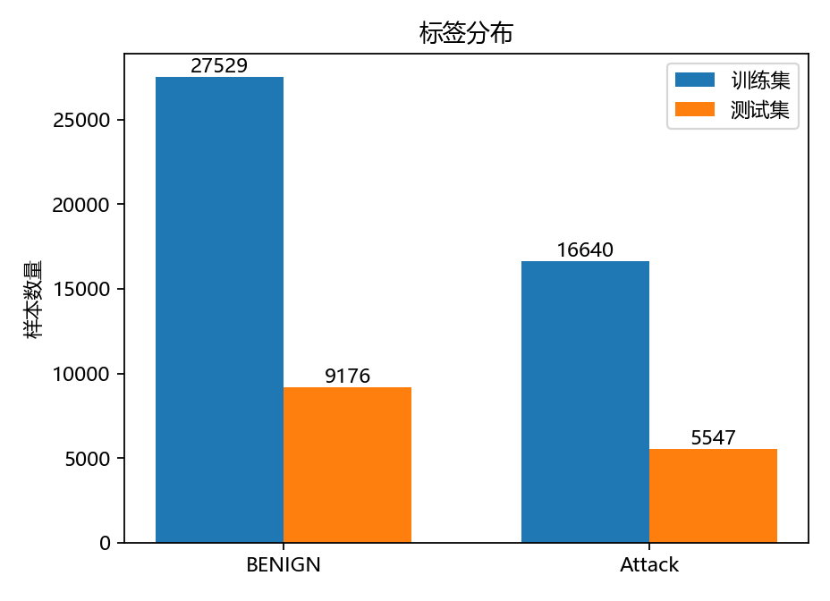
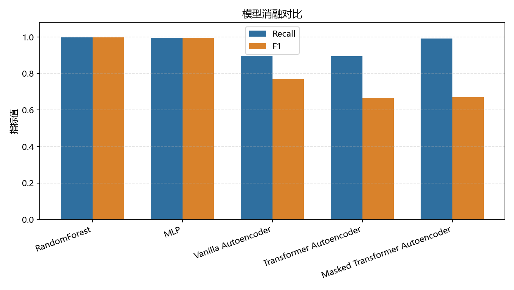
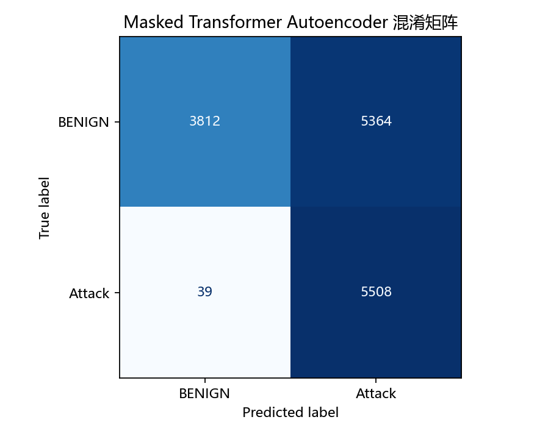
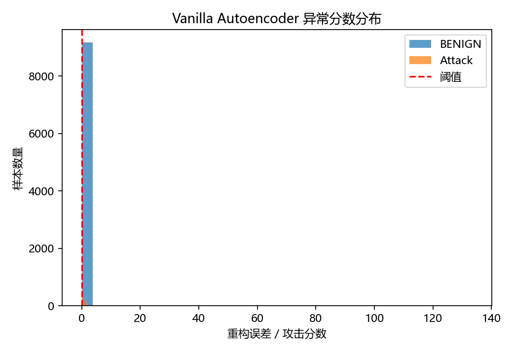
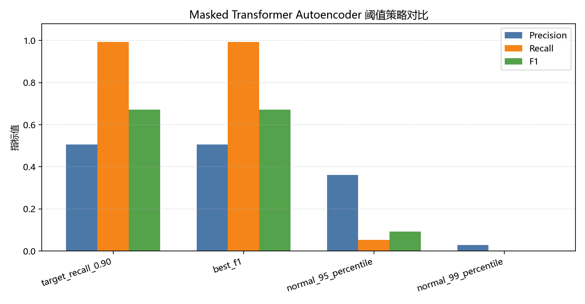
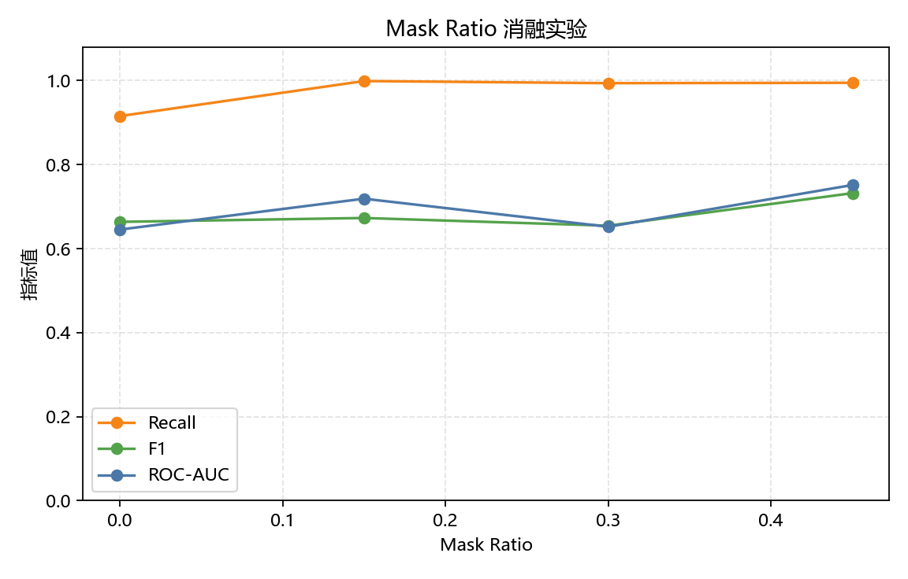
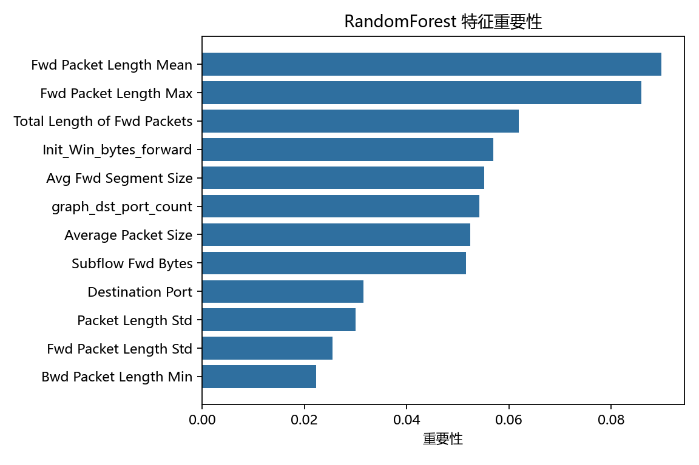
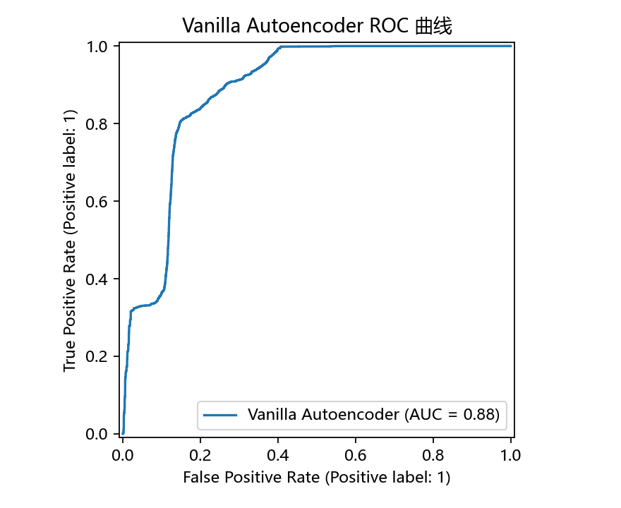

# 基于自监督 Transformer 的网络流量异常检测

这是一个面向课程汇报的小型实验项目。项目目标是参考近年网络安全与人工智能论文中的 **自监督学习**、**Transformer 注意力机制** 和 **异常检测** 思路，在网络流量数据上判断一条流量记录是正常流量还是攻击流量。

## 项目做什么

本项目把网络入侵检测任务简化成二分类问题：

- `BENIGN`：正常流量
- `Attack`：攻击流量，包含 DoS、DDoS、PortScan、Bot 等不同攻击类型

实验会训练多组模型和研究型增强模块进行对比：

1. `RandomForest`：传统机器学习基线模型。
2. `MLP`：普通深度学习全连接网络。
3. `Vanilla Autoencoder`：普通自编码器，用来做消融实验。
4. `Transformer Autoencoder`：加入 Transformer 注意力机制的自监督异常检测模型。
5. `Masked Transformer Autoencoder`：加入掩码重构任务的 Transformer 自编码器。
6. 轻量图结构特征：如果数据包含 IP/端口字段，会自动生成源主机出度、目的主机入度、边出现次数等关系特征。
7. 不同阈值策略：通过目标 Recall 选择异常阈值，体现网络安全中“少漏报”的需求。

## 目录结构

```text
.
├── data/                  # 放 CIC-IDS2017 或演示 CSV 数据
├── docs/                  # 论文讲解与汇报大纲
├── results/               # 自动生成指标表和图片，本目录产物不上传 GitHub
├── presentation_workspace/ # 本地 PPT 工作区，不上传 GitHub
├── src/
│   ├── preprocess.py      # 数据清洗、标签转换、标准化
│   ├── evaluate.py        # 指标计算、混淆矩阵、ROC 曲线
│   ├── train_baseline.py  # RandomForest 和 MLP
│   ├── train_ae.py        # Transformer Autoencoder
│   ├── make_demo_data.py  # 生成小型演示数据
│   └── run_research_pipeline.py # 一键运行研究流水线
└── tests/                 # 基础测试
```

## 快速运行

先安装依赖：

```powershell
python -m venv .venv
.\.venv\Scripts\Activate.ps1
pip install -r requirements.txt
```

如果还没有下载真实数据，可以先运行内置演示数据：

```powershell
python -m src.run_research_pipeline --demo-data --demo-samples 600 --epochs 2 --ablation-epochs 1
```

运行结束后，查看 `results/` 目录：

- `data_inspection.md / .json`：真实数据接入体检报告
- `submission_checklist.md`：最终提交清单，列出哪些文件适合放 PPT 或报告
- `pipeline_manifest.json`：本次流水线运行配置和结果概况
- `metrics.csv`：Accuracy、Precision、Recall、F1、ROC-AUC 等指标
- `dataset_summary.json`：训练集、测试集、特征数量、标签分布
- `run_config.json`：本次实验使用的命令参数，方便复现实验
- `experiment_report.md`：自动生成的实验报告草稿
- `label_distribution.png`：正常流量和攻击流量的样本数量对比
- `feature_importance_randomforest.png`：RandomForest 的特征重要性
- `model_metric_comparison.png`：模型消融对比图
- `threshold_analysis_*.csv / .png`：不同阈值策略的 Precision、Recall、F1 对比
- `confusion_matrix_*.png`：混淆矩阵
- `roc_curve_*.png`：ROC 曲线
- `precision_recall_curve_*.png`：Precision-Recall 曲线，适合类别不平衡场景
- `score_histogram_*.png`：自编码器异常分数分布图

## 使用 CIC-IDS2017 数据

把 CIC-IDS2017 或 Kaggle 清洗版 CSV 文件放入 `data/`，然后运行：

```powershell
python -m src.run_research_pipeline --data-dir data --results-dir results --max-rows 20000 --epochs 10 --ablation-epochs 6 --mask-ratio 0.15
```

这条命令会一次完成：

1. 数据体检；
2. 主实验训练；
3. 阈值策略分析；
4. mask ratio 消融实验；
5. 生成实验报告草稿和提交清单。

这里的 `--max-rows` 表示最多读取多少行，适合电脑配置一般或汇报时间紧张的情况。第一次跑通时建议先用 `5000` 到 `20000` 行，确认流程没问题后再扩大数据量。
`--mask-ratio` 表示训练 Transformer 时随机遮住多少比例的特征。比如 `0.15` 表示遮住 15% 的特征，让模型根据其它特征把它们还原回来。当前真实数据实验显示，掩码重构不是无条件提升，需要结合消融实验判断是否适合具体数据集。
默认会启用轻量图结构特征。如果你想关闭它，可以加上 `--no-graph-features`。

如果只想单独跑某一步，也可以继续使用：

```powershell
python -m src.inspect_data --data-dir data --results-dir results --max-rows 20000
python -m src.run_research_pipeline --data-dir data --results-dir results --max-rows 20000 --epochs 10 --ablation-epochs 6 --mask-ratio 0.15
python -m src.run_mask_ablation --data-dir data --max-rows 20000 --epochs 8 --mask-ratios 0,0.15,0.3,0.45
```

## 研究型增强实验

如果老师特别看重“复现或改进论文方法”，建议额外运行 mask ratio 消融实验：

```powershell
python -m src.run_mask_ablation --data-dir data --max-rows 20000 --epochs 8 --mask-ratios 0,0.15,0.3,0.45
```

这个实验会生成：

- `mask_ratio_ablation.csv`：不同掩码比例的指标表
- `mask_ratio_ablation.png`：Recall、F1、ROC-AUC 随掩码比例变化的折线图
- `attack_type_metrics.csv`：不同攻击类型上的 Recall 和 F1

它的意义是回答：**为什么选择某个掩码比例？掩码比例过小或过大会不会影响检测效果？**

## 最新真实数据结果

当前已在 CIC-IDS2017 清洗版多攻击混合数据上跑通实验，包含 `DDoS`、`PortScan`、`Web Attack Brute Force`、`Web Attack XSS` 和 `Web Attack Sql Injection`。为了适合课程演示，实验读取 60000 行，训练集 44169 行，测试集 14723 行，特征数 79。

| 模型 | Accuracy | Precision | Recall | F1 | ROC-AUC |
| --- | ---: | ---: | ---: | ---: | ---: |
| RandomForest | 0.9994 | 1.0000 | 0.9984 | 0.9992 | 1.0000 |
| MLP | 0.9974 | 0.9973 | 0.9957 | 0.9965 | 0.9996 |
| Vanilla Autoencoder | 0.7970 | 0.6730 | 0.8971 | 0.7690 | 0.8840 |
| Transformer Autoencoder | 0.6640 | 0.5321 | 0.8960 | 0.6677 | 0.6396 |
| Masked Transformer Autoencoder | 0.6330 | 0.5066 | 0.9930 | 0.6709 | 0.6824 |

结果说明：

- 多攻击混合实验比单 PortScan 更可信，`data_inspection.md` 会显示 5 种攻击标签。
- `RandomForest` 和 `MLP` 仍然接近满分，说明 CIC-IDS2017 的监督表格特征区分度很强。
- `Vanilla Autoencoder` 在自监督模型中综合表现最好，说明重构误差异常检测本身有效。
- `Masked Transformer Autoencoder` 的 Recall 最高，适合强调“少漏报”的安全目标，但 Precision 和 F1 会下降。
- `attack_type_metrics.csv` 会按 DDoS、PortScan、WebAttack 等攻击类型统计 Recall 和 F1，避免只看总体平均。
- 自编码器训练只使用正常样本；验证集标签用于异常分数方向校准和阈值选择，因此汇报时应表述为“自监督表示学习 + 少量标签阈值校准”。

## 运行效果图

下面是从本地 `results/` 精选出来、用于 GitHub 展示和课程汇报的效果图。完整实验输出仍然可以通过流水线重新生成。

| 数据与总体结果 | 模型对比 |
| --- | --- |
|  |  |

| 误报漏报 | 异常分数解释 |
| --- | --- |
|  |  |

| 阈值策略 | Mask Ratio 消融 |
| --- | --- |
|  |  |

| 特征重要性 | ROC 曲线 |
| --- | --- |
|  |  |

## 推荐汇报流程

如果时间很紧，可以按下面顺序准备：

1. 先运行 `python -m src.run_research_pipeline --demo-data --demo-samples 600 --epochs 2 --ablation-epochs 1`，确认代码能跑通。
2. 下载或整理 CIC-IDS2017 CSV，放到 `data/` 目录。
3. 运行 `python -m src.run_research_pipeline --data-dir data --max-rows 20000 --epochs 10 --ablation-epochs 6`。
4. 打开 `results/experiment_report.md`，把里面的实验结果整理进 PPT。
5. 打开 `results/submission_checklist.md`，按清单检查要放进 PPT 的图和表。
6. 从 `results/` 选择四张图放入 PPT：标签分布图、模型消融对比图、混淆矩阵、异常分数分布图。
7. 如果时间允许，补充展示 `threshold_analysis_transformer_autoencoder.png` 和 `mask_ratio_ablation.png`，说明阈值选择和掩码比例选择都有实验依据。

## 方法解释

`Transformer Autoencoder` 和 `Masked Transformer Autoencoder` 的核心想法是：

1. 只拿正常流量训练模型，让模型学会“正常网络行为长什么样”。
2. `Transformer Autoencoder` 把每个数值特征看成一个 token，用注意力机制学习特征之间的关系。
3. `Masked Transformer Autoencoder` 在训练时随机遮住一部分特征，让模型根据剩余特征还原完整输入。
4. 测试时输入一条流量记录后，模型尝试把它还原出来。
5. 如果异常分数超过阈值，就把它判为攻击。

这就是自监督异常检测：训练阶段不需要大量攻击标签，模型主要从正常样本中学习规律。

## 论文方法如何落到本项目

| 论文思想 | 本项目实现 |
| --- | --- |
| Autoencoder 用重构误差发现异常 | `Vanilla Autoencoder`、`Transformer Autoencoder` 和 `Masked Transformer Autoencoder` 都输出重构误差 |
| Transformer 学习网络流量中的复杂关系 | 把一条流量的多个特征看成特征 token，用 Transformer Encoder 建模特征关系 |
| 自监督学习减少对攻击标签的依赖 | 只用正常样本训练自编码器，不要求大量攻击样本参与训练 |
| 掩码重构任务 | 训练时随机遮住部分特征，让模型根据上下文恢复完整正常流量 |
| 阈值策略分析 | 对比目标 Recall、最佳 F1、正常样本分位数等阈值选择方式 |
| 异常分数方向校准 | 用验证集检查“高重构误差”还是“低重构误差”更像攻击，避免不同数据子集上分数方向相反 |
| 图神经网络/图 Transformer 思路 | 用 IP/端口生成源主机出度、目的主机入度、边出现次数、端口访问频率等轻量图统计特征 |

为了让实验评价更严谨，正式训练入口会先划分训练集和测试集，再只用训练集拟合缺失值填充值、标准化器和图结构统计量。这样测试集不会提前参与特征统计，可以避免评价结果被“测试集信息泄漏”抬高。
自编码器训练仍然只使用正常样本；验证集标签只用于校准异常分数方向和选择阈值，所以汇报时应表述为“自监督表示学习 + 少量标签阈值校准”。

## GitHub 上传说明

本仓库适合上传代码、测试、文档和精选效果图，不上传大数据、完整实验输出和 PPT：

- 上传：`src/`、`tests/`、`docs/`、`docs/figures/`、`README.md`、`requirements.txt`、`.gitignore`。
- 不上传：`data/` 中的真实 CSV、`results/` 中的完整输出、`presentation_workspace/` 中的 PPT 文件、`papers/` 中的论文 PDF。
- 如需复现实验，请先自行下载 CIC-IDS2017 或 Kaggle 清洗版 CSV 放入 `data/`，再运行 `python -m src.run_research_pipeline --data-dir data --max-rows 20000 --epochs 10 --ablation-epochs 6`。

## 代码模块怎么理解

- `preprocess.py` 是数据入口。它负责把原始 CSV 清洗成数字矩阵，这是所有模型训练的前提。
- `preprocess.py` 还会在存在 IP/端口字段时生成轻量图结构特征，并且只用训练集统计这些关系特征，让项目和 GNN/Graph Transformer 论文思想更接近。
- `train_baseline.py` 是对照组。它训练 `RandomForest` 和 `MLP`，用来说明自监督模型不是孤立比较。
- `train_ae.py` 是核心模型。它训练普通 Autoencoder、Transformer Autoencoder 和 Masked Transformer Autoencoder，体现论文中的自监督异常检测思想，并提供消融对比。
- `evaluate.py` 是评价模块。它把模型输出变成指标和图表。
- `artifacts.py` 是汇报材料模块。它把实验配置、数据概况和结果自动整理成报告。
- `run_research_pipeline.py` 是总控流水线。它把数据体检、主实验、消融实验和提交清单串起来。

## 参考论文

1. Jalal Ghadermazi et al. **GTAE-IDS: Graph Transformer-Based Autoencoder Framework for Real-Time Network Intrusion Detection**. IEEE Transactions on Information Forensics and Security, 2025.
2. Daniel L. Marino et al. **Self-Supervised and Interpretable Anomaly Detection Using Network Transformers**. IEEE Transactions on Industrial Informatics, 2025.
3. Renjie Xu et al. **Applying self-supervised learning to network intrusion detection for network flows with graph neural network**. Computer Networks, 2024.
